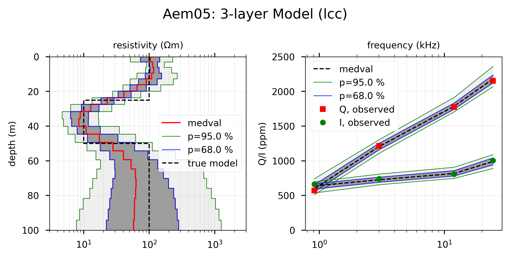
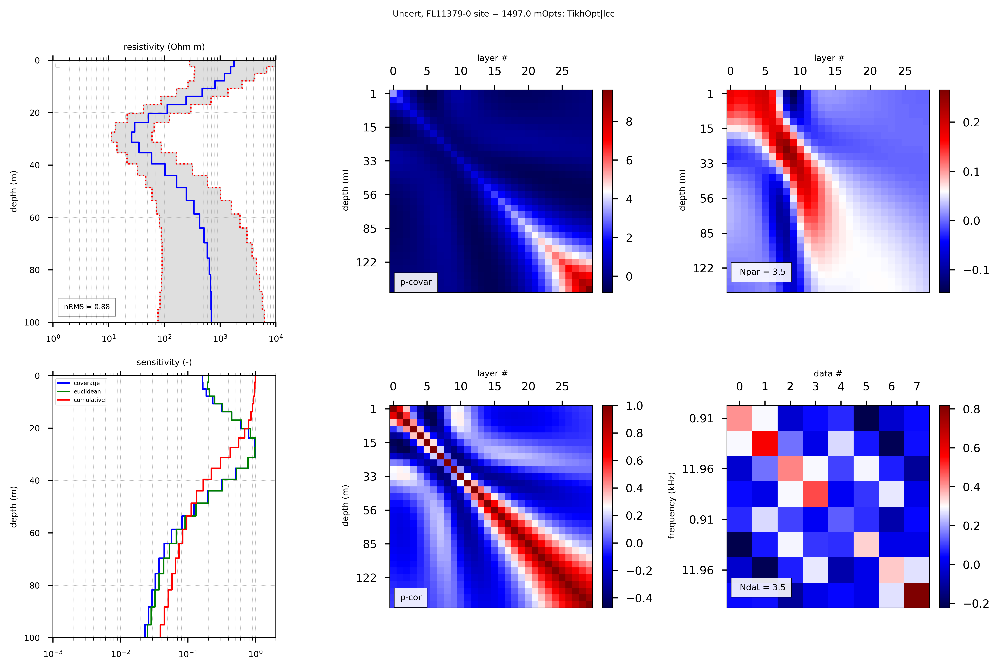

# Tools for processing, inversion, and interpretation of Airborne ElectroMagnetics (AEM)

This is the public repository for the  Airborne Electromagnetic Inversion toolbox "AEMpyX", which was originally developed at DIAS starting with the project "Spatially constrained Bayesian inversion of frequency- and time-domain electromagnetic data from the Tellus projects" (2015-sc-004), followed by "RAFTA: Resolution Analyses for Frequency- and Time-Domain Airborne Electromagnetic Data of the Irish Tellus Programme" (2020-sc-049), both funded by the Geological Survey of Ireland GSI. It is distributed under the GNU GENERAL PUBLIC LICENSE Version 3. Currently it is expanded to include more algorithms (in particular for uncertainty quantification, UQ), platforms, and a branch for making it useful for magnetotelluric (MT) modelling and inversion. 

   

   
   Inversion results for synthetic ensemble of perturbed 3-layers for AEM05 FD data.

AEMpyX currently works fully under linux operating systems, but mostly also under  windows (here short for Windows 10). There are of course changes in the installation procedures, as mentioned below. 

Under linux, get your working copy directly via git from the command line. In windows, git functionality is available, once Anaconda is installeded (see below). There, open the powershell terminal and clone the repository with the same line as in linux: 

_git clone https://github.com/RAFTA-AIRBORNE/AEMpyX_public.git_

The created local repository AEMpyX contains the following subdirectories:

- 	**aempy/tutorial**
 	Contains python scripts and jupyter notebooks for the most important scripts, explaining typical AEM preprocessing, 
	visualization, one-dimensional inversion, and uncertainty quantification workflows, using the toolbox. 

-	**aempy/modules**
 	Contains the modules _aesys.py_, _prep.py_, _post.py_, _viz.py_, _inverse.py_, _alg.py_, and _util.py_, which 
	are called from the Python scripts in **aempy/scripts** and **aempy/tutorial**, accomplishing 
	different tasks of AEM inversion. It also contains the _core1d.so_ (or _core1d.pyd_ whem using windows) module, 
	once compiled from the sources in **aempy/core1d**.
 	
- 	**aempy/core1d**
	This directory contains the Fortran 90 source code for the computational core run by the Python toolbox. 
	The numerics is derived from the AMIRA/CSIRO AirBeo software. Currently it contains working wrappers for 
	the two systems used in Tellus: GTK4, and CGG GENESIS, with TEMPEST and GEOTEM under development. This 
	directory also contains makefiles for both operating systems, named _Makefile_linux_ or _Makefile_windows_, 
	respectively.
 	
- 	**aempy/other_scripts**
    Contains a collection of scripts for processing, visualization, and other tasks related to one-dimensional inversion of 
    AEM data;. Also included is a workflow for static shift correction of MT observations (work in progress). These scripts
    come from different stages of the RAFTA project, solving specific problems. Thus they may not be up to date. However, they
  	represent a useful source for cannibalizing. 

-	**aempy/util**
    Contains  useful helper shell scripts etc. 
	
-	**aempy/doc**
	This is the place where the manual, but also publications/presentations are developed.

-	**aempy/info**
	Documentation for software related to the toolbox, as python (including the most important extensions, numpy,
	scipy, and matplotlib), and other tools. 
	
- 	**environment**
	Contains conda environment description files, and some useful helper files for working within the 
	conda environment. For linux and windows you can find special versions in the respective directories. 
	The current AEMpyX environment contains some packages which are not strictly necessary for running 
	the toolbox, but useful for related geoscientific work. 
	
	
This version will run under Python 3.9+ (3.11 being the current development platform). For installing the python environment in any Linux environment (e.g. Ubuntu, SuSE), you need to do the following:

(1) Download the latest Anaconda or Miniconda version (https://docs.conda.io/projects/conda/en/latest/user-guide/install/download.html), and install by running the downloaded bash script with:  

_bash Miniconda3-latest-Linux-x86_64.sh_

For windows just execute the downloaded executable, _Miniconda3-latest-Windows-x86_64.exe_. In order to make updates secure and avoid inconsistencies, copy .condarc from AEMpyX/environment to your home directory. As the Miniconda installer is not updated very frequently, it is useful  to run the following within Anaconda:

_conda update conda_

_conda update --all_

Do this regularly to keep everything consistent! 

(2) Create an appropriate conda environment (including the necessary prerequisites) from the files AEMpyX.yml or AEMpyX.txt found in the AEMpyX/environment  directories by entering

_conda env create -f AEMpyX.yml_

or

_conda create --name AEMpyX --file AEMpyX.txt_

in the command window (powershell under windows).

This will set up a Python 3.11 environment with all dependencies for aempy. Don't forget to update also the used environment regularly, using _conda update --name AEMpyX --all_! 

(3) Activate this environment by:

_conda activate AEMpyX_

(4) Within this envionment you now need to compile the aempy core, which is written in Fortran 90, and thus needs compilation. For this purpose, _f2py_ (part of _numpy_), and the required  compilers have been included in the EM environments. To compile and install the numerical core, go to the _core1d_ directory, and enter 

_make -f Makefile_linux_  or  _make -f Makefile_windows_ 

respectively. If this is succesful, a dynamical library, _core1d.so_ (_core1d.pyd_ under windows), should be in the _modules_ subdirectory. 

(5) In order to reproduce identical behavior of matplotlib, you should copy the included  _matplotlibrc_ file to the appropriate directory. Under Linux (Ubuntu), this should be : _$HOME/.config/matplotlib/matplotlibrc_. Pertinent changes should be made there, or have to be made within the scripts/modules using the _mpl.rcParams[name]=value_ mechanism. 

(6) For running aempy scripts, we have defined two environmental variable, _AEMPYX_ROOT_ and _AEMPYX_DATA_. These point to the place where AEMpyX is installed, and where you keep your AEM data, respectively. Keeping to this scheme makes life much easier if more than one person work on the tools.

In linux you can set them in your _.bashrc_ file. Example: 

_export AEMPYX_ROOT='${HOME}/AEMpyX/'_	

_export AEMPYX_DATA='${HOME}/AEM_Data/Tellus/data/'_

Under windows, you should use the system settings dialogue to do so. 

(7) Finally, the remaining open source toolboxes you want to use need to be installed, either via the anaconda framework, or the _pip_ command. 

(8) Once in the activated conda environment _AEMpyX_, there are several ways to start python scripts or jupyter notebooks (https://jupyter.org/). 

For getting started with python **scripts**, we suggest to use the _spyder_ IDE (https://www.spyder-ide.org/), which is already installed within _AEMpyX_. It has been developed for easy development of python software, including visualisation with _matplotlib_ and derived packages. Current versions (5.X) also allow to work with other languages as  JULIA or R languages, or with jupyter notebooks by installing the appropriate plugin. 

However, as we have defined the environmental variables in step (6), the scripts can be run from anywhere in the system, either from the activated AEMpyX environment, or using _conda run_ (see, _https://docs.conda.io/projects/conda/en/latest/commands/run.html_) from an initialized conda (i.e., base environment). Running python scripts directly from the command line can be done in different ways:

_python3 -u mypythonscript.py > output.log_, 

if you are in AEMpyX. If the magic first line _#!/usr/bin/env python3_ exists in the skript, it can be called as 

_mypythonscript.py > output.log_.

If anywhere in an conda environment, use 

_conda run_ -n AEMpyX mypythonscript.py

The usual way to work with **notebooks** is with your favorite web browser, or specialized software as _jupyterlab_. If using your browser (as set in your system as default) you can simply use the classical interface

_jupyter notebook mynotebook.ipynb_ 

or the new one

_jupyter lab mynotebook.ipynb_

Both calls will open a new browser window, in which you can edit and run the notebook. The _jupiterlab_ is the future interface for notebooks, and there are many options not available with the classical call (https://jupyterlab.readthedocs.io). Remote clusters often offer a specialized server (JupyterHub) to develop and run notebooks. 

Uncert_FL11379-0_site1497.0m

   

   
   Uncertainty-related plots for a site from Tellus A1 block. Top left: model with error bars. Bottom left: sensitivities. Top center: Parameter covariance a posteriori. Bottom center: Parameter 
correlation. Top right: Parameter resolution. Bottom right: Data resolution. 

Enjoy, read the docs, but please keep in mind that this is an experimental software, and may contain errors. Use at your own risk! However, we will frequently update the repository correcting bugs, and adding additional functionality.   

D. Kiyan & V. Rath

November 18, 2023
